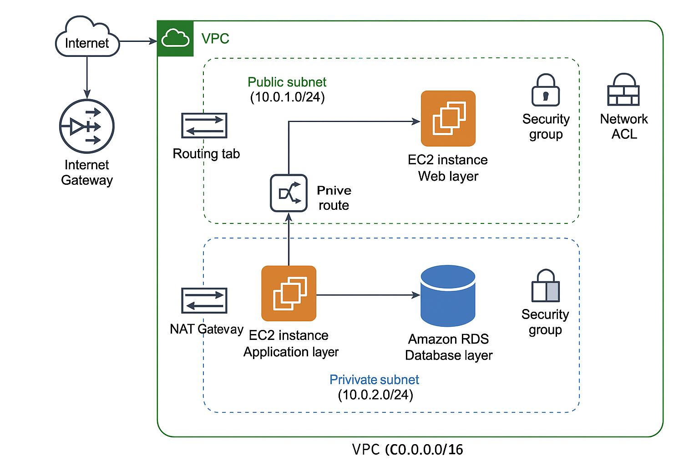

# 🧱 AWS 3-Tier Architecture Project

This project demonstrates a secure, production-style 3-tier architecture on AWS using Free Tier resources. It includes a public-facing web server, a private application server, and a private RDS PostgreSQL database.

---

## 📐 Architecture Overview

### 🔹 Web Layer (Public Subnet)
- EC2 instance with public IP
- Hosts NGINX or acts as a reverse proxy
- Accessible via HTTP and SSH (restricted to my IP in Security Group)

### 🔹 App Layer (Private Subnet)
- EC2 instance with no public IP
- Runs a Flask app that connects to RDS
- Only accessible from Web Layer

### 🔹 Database Layer (Private Subnet)
- Amazon RDS PostgreSQL
- No public access
- Only accessible from App Layer

---

## 🚀 How It Works

1. User sends HTTP request to Web EC2
2. Web EC2 forwards request to App EC2 (private IP)
3. App EC2 queries RDS and returns response

---

## 🧪 Testing

- ✅ SSH from laptop → Web EC2
- ✅ SSH from Web EC2 → App EC2
- ✅ App EC2 → RDS via `psql`
- ✅ Web EC2 → App EC2 via `curl`

---

## 🧹 Cleanup

See [`cleanup-checklist.md`](cleanup-checklist.md) for safe teardown steps to avoid charges.

---

## 📁 Folder Contents

| File/Folder         | Description                          |
|---------------------|--------------------------------------|
| `app/`              | Flask app code                       |
| `architecture-diagram.png` | Visual layout of the architecture |
| `cleanup-checklist.md` | Safe teardown checklist            |
| `docs/notes.md`     | Personal notes and commands          |

---

## 🧠 Lessons Learned

- How to isolate layers using subnets and security groups
- How to connect EC2 to RDS securely
- How to test and troubleshoot VPC-level connectivity

---

## 📌 Future Enhancements

- Add Terraform for IaC
- Add ALB and Auto Scaling
- Add CI/CD pipeline using GitHub Actions

✅ This project is part of my DevOps Learning journey. Feel free to fork or star the repo if you find it helpful!
