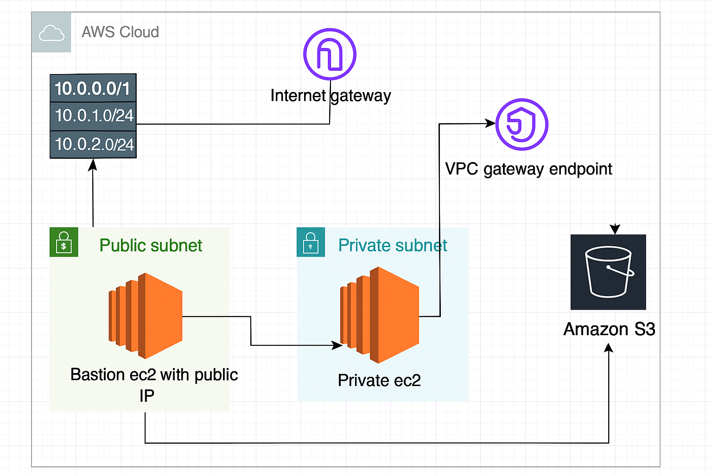

# 🛡️ AWS S3 Access via VPC Gateway Endpoint (with NAT Gateway)

This project demonstrates how to securely access an Amazon S3 bucket from a private EC2 instance using a **VPC Gateway Endpoint**, while also enabling general internet access via a **NAT Gateway**. This hybrid setup mirrors real-world production environments where both secure internal access and external connectivity are required.

---

## 📌 Project Goals

- Create a secure VPC with public and private subnets
- Launch a Bastion host in the public subnet for SSH access
- Launch a private EC2 instance in the private subnet
- Create an S3 bucket with blocked public access
- Use a VPC Gateway Endpoint to access S3 privately
- Use a NAT Gateway for outbound internet access from private subnet
- Attach IAM roles to EC2 instead of using access keys

---

## 🧱 Architecture Diagram



---

## 🗂️ Folder Structure

| Folder        | Description                                      |
|---------------|--------------------------------------------------|
| `infra/`      | Infrastructure as Code templates                 |
| `scripts/`    | (Optional)Shell scripts for testing or automation|
| `docs/`       | Diagrams and architecture notes                  |
| `screenshots/`| CLI or AWS Console screenshots for documentation |
| `README.md`   | This file                                        |

---

## 🚀 Setup Steps

### 1. Create VPC and Subnets
- VPC CIDR: `10.0.0.0/16`
- Public Subnet: `10.0.0.0/24` (`Demo_Public_Subnet`)
- Private Subnet: `10.0.1.0/24` (`Demo_Private_Subnet`)

### 2. Launch EC2 Instances
- `Demo_Public_EC2`: Bastion Host in public subnet, SSH access from your IP
- `Demo_Private_EC2`: Private EC2 instance, no public IP, SSH only via Bastion

### 3. Create S3 Bucket
- Name: `demo-s3bucket-123456789`
- Block all public access

### 4. Create NAT Gateway
- Allocate Elastic IP
- Attach NAT Gateway to public subnet
- Update private route table:
  - `0.0.0.0/0` → NAT Gateway

### 5. Create VPC Gateway Endpoint for S3
- Service: `com.amazonaws.us-east-1.s3`
- Type: Gateway
- Attach to private route table
- Adds route to S3 prefix list automatically

### 6. Attach IAM Role to Private EC2
- Role: `Demo_EC2-S3_Role`
- Permissions:
  ```json
  {
    "Effect": "Allow",
    "Action": ["s3:ListBucket", "s3:GetObject"],
    "Resource": [
      "arn:aws:s3:::demo-s3bucket-123456789",
      "arn:aws:s3:::demo-s3bucket-123456789/*"
    ]
  }
  ``` 
### 7. Test from Private EC2
```bash
aws s3 ls s3://demo-s3bucket-123456789
```

## ���️ Terraform Implementation
This project has been fully automated using Terraform. All .tf files are located in the scripts/ folder and follow a modular, readable structure.

## ��� scripts/ Folder Contents

provider.tf	     --> AWS provider configuration
variables.tf     --> Input variables (region, CIDRs, key name, etc.)
terraform.tfvars --> Actual values for variables (e.g., key name, IP)
vpc.tf           --> VPC, subnets, route tables, and internet gateway
bastion.tf       --> Bastion host EC2 instance and security group
private_ec2.tf   --> rivate EC2 instance with IAM role and SG
s3.tf            --> S3 bucket with public access blocked
vpc_endpoint.tf  --> VPC Gateway Endpoint for S3
nat_gateway.tf   --> NAT Gateway and private route table update
iam.tf           --> IAM role, policy, and instance profile for EC2
outputs.tf       --> Outputs like Bastion public IP for easy access

##  ��� Deploy with Terraform
From the scripts/ directory:
```bash
terraform init
terraform plan
terraform apply
```
Once deployed, SSH into the Bastion host and then into the private EC2 instance to test S3 access using the AWS CLI.

🧠 Key Learnings
- VPC Gateway Endpoints allow secure, internal access to AWS services
- NAT Gateways are still useful for general internet access
- IAM roles are the preferred way to grant EC2 permissions
- Route tables can support both NAT and VPC endpoints simultaneously
- Terraform makes infrastructure reproducible, scalable, and version-controlled

✅ This project is part of my DevOps Learning journey. Feel free to fork or star the repo if you find it helpful!
